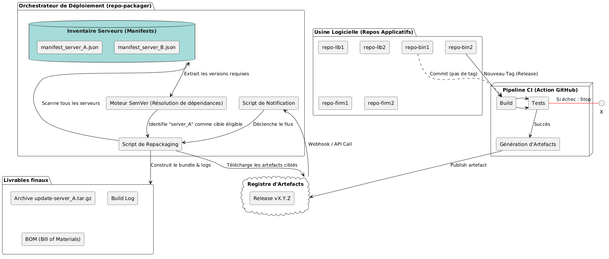
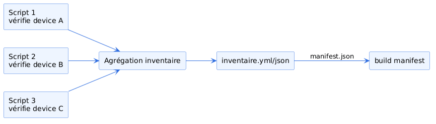

     
# Architecture CI/CD pour systèmes matériels modulaires
*Du build multi-cibles au provisionnement basé sur l'inventaire*
       
---

## Slide 1 : Introduction & Point de départ (L'expérience passée)
    
* Sébastien Galvagno – Ingénieur DevOps
* Approche technique basée sur l'expérience
* Cas d'usage : Chaîne de build multi-OS (GitHub Actions)
* Système adaptatif : 2 repos interconnectés

    
---
    
## Slide 2 : Généralisation du concept (La Notification)

* Architecture applicative distribuée (Multi-repos)
* Dépôts sources (Binaires, Librairies) ➔ Dépôt agrégateur (`repo-packager`)
* Mécanique : Release ➔ Notification ➔ Repackaging

    
---

## Slide 3 : Le Repackaging Multi-Cibles (L'adaptation au matériel)
    
* Objectif : S'adapter aux configurations matérielles (infrastructures, périphériques)
* Un orchestrateur, de multiples cibles
* Construction pilotée par des *Manifests* spécifiques

    
---

## Slide 4 : Démonstration - L'Orchestration en Action

---

## Slide 5 : L'Inventaire Matériel (La garantie du Manifest)

